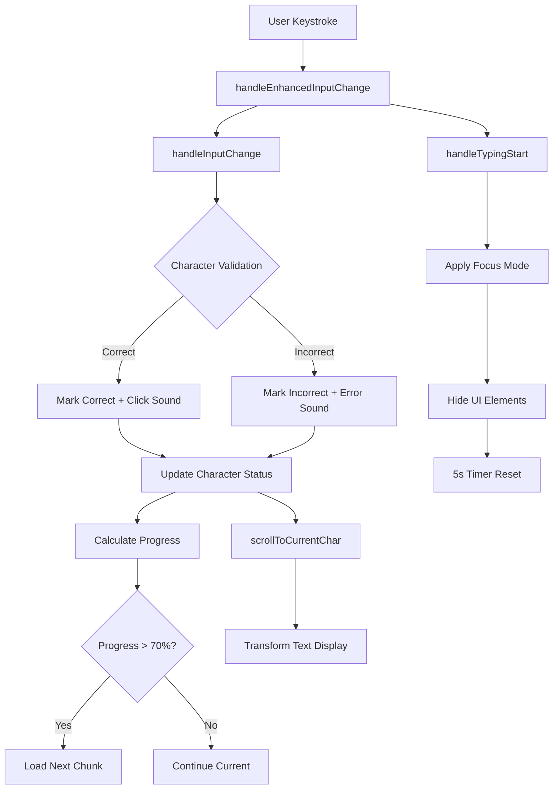
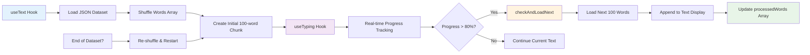
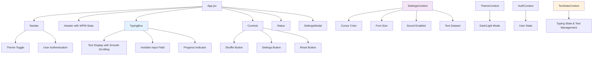
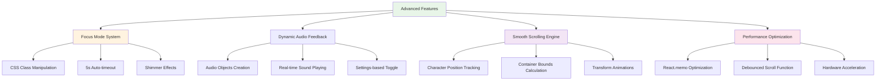

# Keyflow

_A modern, minimalistic typing practice application built for typing enthusiast_

[](https://keyflow-bay.vercel.app/) [](https://youtu.be/5zWI6RrTxos)

----------

## What is Keyflow?

Keyflow is a minimalistic typing web app built with modern web technologies, it provides a seamless typing practice experience that adapts to both desktop and mobile environments.

## Distinctiveness & Complexity

Keyflow is designed as a typing practice application centered on real-time performance and interactivity. This focus on continuous user input, instant validation, and live statistics makes it unique within the course context.

In terms of complexity, Keyflow is challenging because of how much happens in real time. Every keystroke from the user is captured, validated, and used to update typing statistics instantly. This required careful use of **React state management**, including Context API and custom hooks, to share data across components efficiently. For example, when the user types a character, the app needs to immediately check if it’s correct, update the cursor, recalculate accuracy and WPM, and re-render the stats on the screen.

Although the frontend (React) holds most of the logic, the **Django backend** is still important. It manages data, provides API endpoints, and handles authentication. Having to integrate React with Django also added to the complexity, since I had to make the two work together smoothly.

Some of the features that made the project complex:

-   Real-time WPM and accuracy calculation
    
-   Multiple text datasets with chunk loading
    
-   Settings panel for customizing font size, sounds, and colors
    
-   Responsive design for both desktop and mobile
    

Altogether, this project proved more challenging than previous ones, as it pushed me beyond my existing skills and required learning many new concepts. The most valuable insight I got is that how the software development lifecycle works, from planning and architecture to implementation and testing, It provide me a practical understanding of how complex applications are built in the real world.

----------

## Architecture


### Real-Time Typing Processing Flow

The core typing engine processes keystrokes with advanced features like dynamic scrolling and focus mode:



### Dynamic Text Management System

Advanced text chunking and infinite scroll implementation:



### Component Interaction Map

Detailed component relationships and data flow:



### Advanced Features Architecture

Key sophisticated features implementation:



----------

## Getting Started

### Prerequisites

-   **Node.js** (v16 or higher)
-   **Python** (v3.8 or higher)
-   **pip** (Python package manager)

#### 1. Clone the Repository

```bash
git clone https://github.com/gaurabprasai/keyflow.git
cd keyflow

```

#### 2. Backend Setup

```bash
cd backend
pip install -r requirements.txt
python manage.py migrate
python manage.py runserver

```

_Backend will be available at `http://localhost:8000`_

#### 3. Frontend Setup

```bash
cd frontend
npm install
npm run dev

```

_Frontend will be available at `http://localhost:5173`_

#### 4. Access the Application

Open your browser and navigate to `http://localhost:5173`

----------

## Contributing

1.  Fork the repository
2.  Create a feature branch (`git checkout -b feature/amazing-feature`)
3.  Commit your changes (`git commit -m 'Add amazing feature'`)
4.  Push to the branch (`git push origin feature/amazing-feature`)
5.  Open a Pull Request

----------

## Acknowledgments

-   **CS50 Web Programming Course** - For the foundational knowledge
-   **Harvard University** - For the excellent curriculum
-   **Open Source Community** - For the amazing tools and libraries

----------

<div align="center">

**Built with ❤️ for CS50 Web Programming with Python and JavaScript**

[⭐ Star this repo](https://github.com/yourusername/keyflow) • [🐛 Report Bug](https://github.com/yourusername/keyflow/issues) • [💡 Request Feature](https://github.com/yourusername/keyflow/issues)

</div>